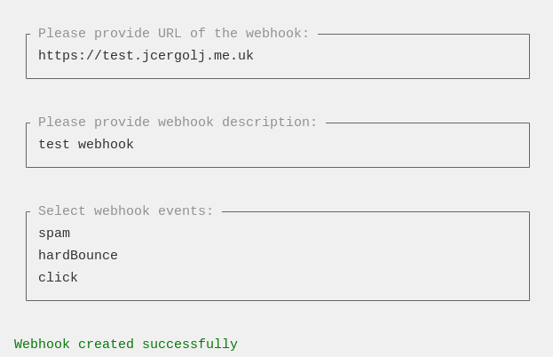

# Brevo Webhook Manager CLI Tool for Laravel
This CLI tool provides a convenient way to manage Brevo webhooks from the command line. It provides a number of commands for fetching, creating, updating, and deleting webhooks.



Features:
- Fetch webhooks from the Brevo API
- Create new webhooks
- Update existing webhooks
- Delete webhooks

## Installation

### Requirements
Required PHP >=8.2

### Installing package
```bash
composer require jcergolj/brevo-webhook-manager-for-laravel
```

### Publishing config file
```bash
php artisan vendor:publish --provider="Jcergolj\BrevoWebhookManager\BrevoWebhookMangerServiceProvider"
```

### .env file
```bash
BREVO_API_KEY=
USER_AGENT=""
BREVO_BASE_URL=https://api.brevo.com/v3/
```

### Avaliable commands
```bash
php artisan brevo-webhooks:create-inbound
```

```bash
php artisan brevo-webhooks:create-marketing
```

```bash
php artisan brevo-webhooks:create-transactional
```

```bash
php artisan brevo-webhooks:update
```

```bash
php artisan brevo-webhooks:delete
```

```bash
php artisan brevo-webhooks:fetch
```

```bash
php artisan brevo-webhooks:fetch-all
```
